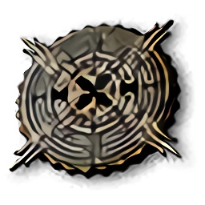

# The Eye of Nehaleni



*The Eye of Nehaleni* is an open source short URL extender. Written in Rust.

🏗 **This project is still in the early stages of development.**

## Usage

```
> ./the-eye-of-nehaleni
the-eye-of-nehaleni 0.1.0
github.com/jerryshell/the-eye-of-nehaleni

USAGE:
    the-eye-of-nehaleni --url <URL>

OPTIONS:
    -h, --help         Print help information
    -u, --url <URL>    
    -V, --version      Print version information
```

### Example

```
> ./the-eye-of-nehaleni -u https://bit.ly/3A7vZoF
https://github.com/jerryshell

> ./the-eye-of-nehaleni -u https://reurl.cc/7eDRj5                      
https://github.com/jerryshell
```

## Domain names that have been tested for availability

* bit.ly
* reurl.cc
* t.hk.uy
* cn.hk.uy
* x88.ltd
* dwz.date
* dwz.win
* tinyurl.com
* kutt.appinn.net
* dllzff.cn
* pingan.com

## Why is it called *The Eye of Nehaleni* ?

> The Eye of Nehaleni is a quest item in The Witcher 3: Wild Hunt.
> 
> This item is an artifact tied to the deity Nehaleni, and allows Geralt to dispel magic illusions.

-- [Witcher Wiki](https://witcher.fandom.com/wiki/The_Eye_of_Nehaleni)


## License

[GNU Affero General Public License v3.0](https://choosealicense.com/licenses/agpl-3.0/)
